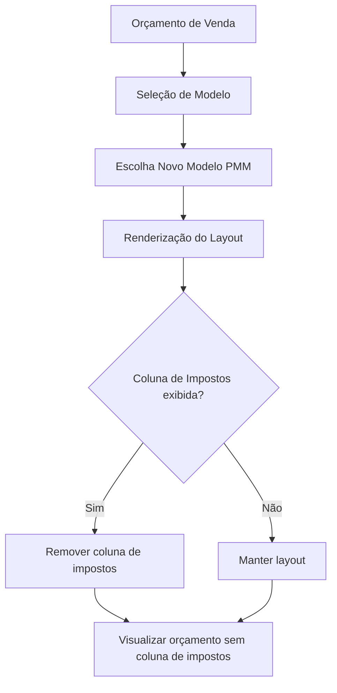
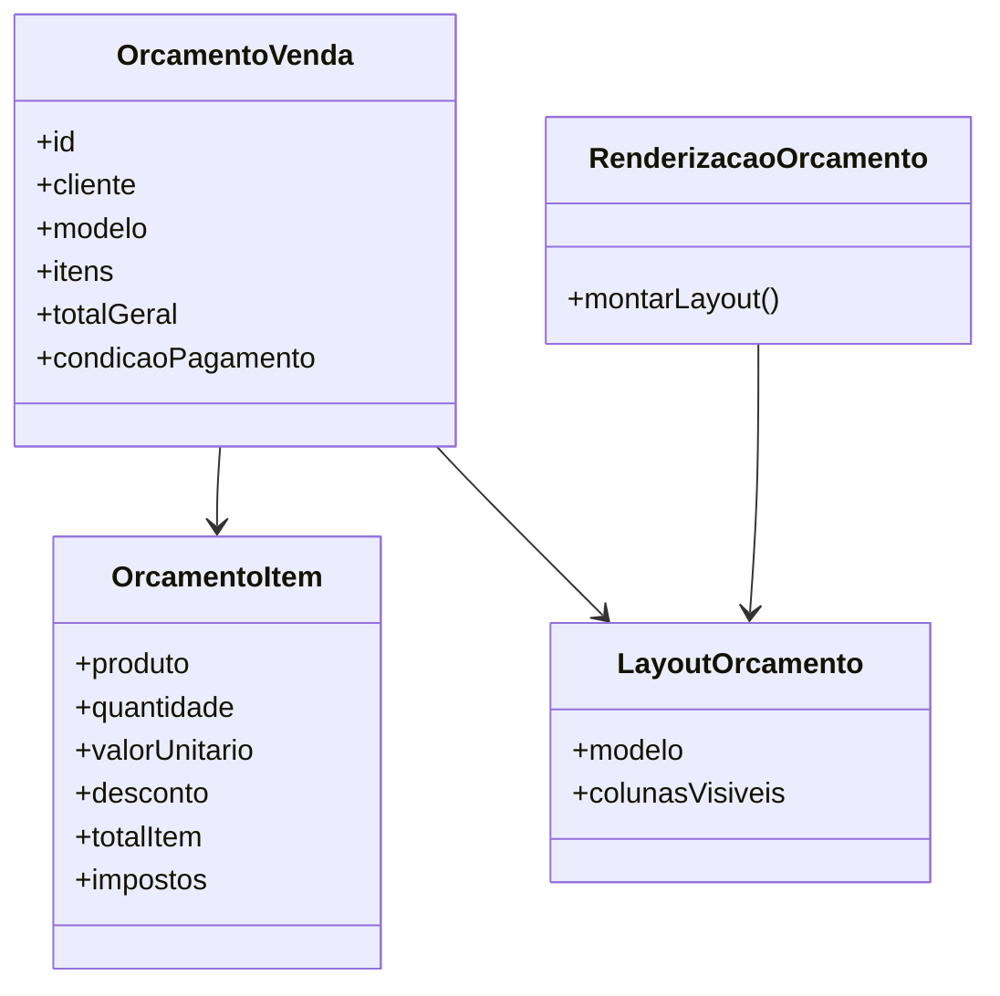

# Especificação Funcional — Remoção da Coluna de Impostos no Layout de Orçamento de Venda (Novo Modelo PMM)

---

## 1. Objetivo

Remover a coluna de impostos do layout de Orçamento de Venda no Novo Modelo PMM, mantendo o foco na apresentação comercial do documento e evitando a exibição de informações fiscais que não são necessárias para o usuário final.

**Observação:** Em caso de dúvidas sobre o comportamento do Novo Modelo PMM ou regras de layout, consultar a equipe de produto.

---

## 2. Fluxo do Processo

---

## 3. Escopo

### Incluído

- Remoção da coluna de impostos do layout de Orçamento de Venda no Novo Modelo PMM;
- Ajuste no componente de exibição para não renderizar a coluna nem os valores de impostos;
- Atualização da lógica de apresentação para o novo modelo;
- Testes de validação do layout e alinhamento visual;
- Verificação para garantir que a alteração não impacte outros modelos de orçamento.

### Não Incluído

- Alterações na lógica de cálculo de impostos;
- Mudança de layout em outros modelos de orçamento;
- Ajustes em cadastros fiscais ou regras tributárias;
- Modificações estruturais no banco de dados.

---

## 4. Descrição Funcional

No Novo Modelo PMM de Orçamento de Venda, o layout deve apresentar os itens, preços, quantidades, descontos e totais sem a coluna de impostos. A coluna de impostos permanece disponível apenas internamente para cálculo e integração, mas não deve ser exibida no documento final.

O ajuste deve preservar os demais campos e evitar que o espaçamento ou o alinhamento da tabela seja afetado pela remoção.

---

## 6. Regras de Negócio

### RN001

No Novo Modelo PMM, a coluna de impostos não deve ser exibida no layout de orçamento.

### RN002

A alteração deve ser aplicada apenas ao Novo Modelo PMM, sem impactar outros modelos existentes.

### RN003

A remoção da coluna não altera o cálculo interno de impostos; apenas remove a exibição do valor no documento.

### RN004

O layout deve manter todos os demais campos previstos no modelo, sem causar desalinhamento ou perda de informação.

---

## 7. Critérios de Aceite

- A coluna de impostos não é exibida no layout do Novo Modelo PMM;
- O orçamento mantém as demais colunas e totais corretamente;
- O documento exibe os itens e valores de forma alinhada;
- O comportamento atual de outros modelos de orçamento permanece inalterado;
- Não há impacto perceptível de performance.

---

## 8. Cenários de Teste

### Cenário 1 — Novo Modelo PMM sem coluna de impostos

**Ação:** Visualizar orçamento no Novo Modelo PMM.

**Resultado Esperado:** O layout é exibido sem a coluna de impostos e mantém os demais campos normalmente.

---

### Cenário 2 — Outros modelos continuam com coluna de impostos

**Ação:** Visualizar orçamento em modelo diferente do PMM.

**Resultado Esperado:** A coluna de impostos permanece disponível conforme o comportamento atual.

---

### Cenário 3 — Orçamento com múltiplos itens

**Ação:** Gerar orçamento com vários itens no Novo Modelo PMM.

**Resultado Esperado:** Nenhum item exibe a coluna de impostos; o alinhamento e os totais permanecem corretos.

---

### Cenário 4 — Layout com desconto e condição de pagamento

**Ação:** Visualizar orçamento que contenha desconto e condição de pagamento.

**Resultado Esperado:** A ausência da coluna de impostos não altera a apresentação de descontos, totais e condições.

---

## 9. Impactos Técnicos

- Ajustes no componente de renderização do layout do orçamento;
- Atualização da configuração de colunas do novo modelo PMM;
- Validação de que o front-end não solicita a coluna de impostos para exibição;
- Testes de regressão para garantir compatibilidade com outros modelos.

---

## 10. Projeção de Classes

---

## 11. Considerações Finais

A remoção da coluna de impostos no layout de Orçamento de Venda do Novo Modelo PMM é uma melhoria de baixo risco focada na clareza do documento comercial. A alteração deve ser implementada com cuidado para preservar a consistência visual e a compatibilidade com os demais modelos de orçamento.
